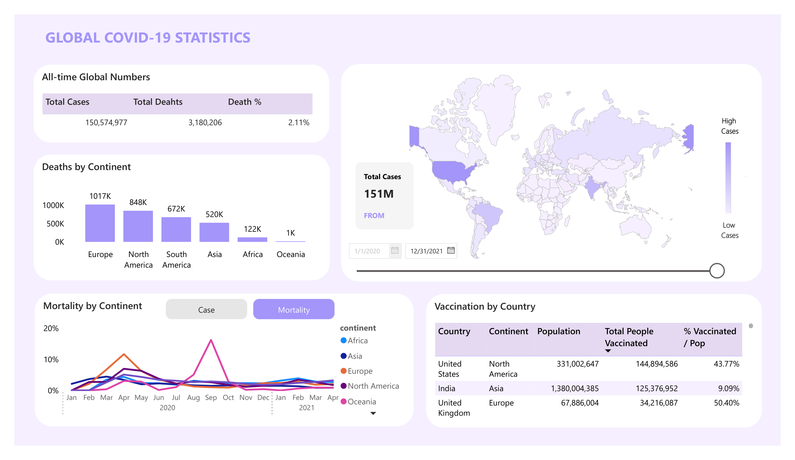
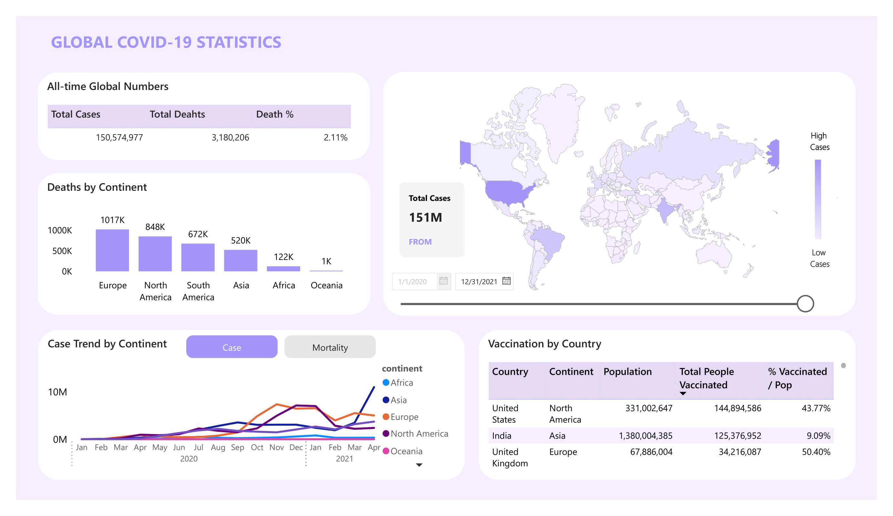

# Background And Overview
The COVID-19 pandemic is a serious global health crisis with unprecedented worldwide spread. As the first pandemic of its kind in modern history, there was initially no vaccine or standardized treatment regimen available.

This project analyzes the COVID-19 pandemic to assess its severity based on the rate of spread and the number of deaths globally. Additionally, it evaluates the effectiveness of vaccines in preventing and controlling the disease.

The chart provides insights into the COVID-19 pandemic from January 1, 2020, to April 30, 2021, highlighting trends in mortality rates, global infection numbers, and the distribution of vaccines across countries.

An interactive PowerBI dashboard can be downloaded [here](https://github.com/nhatnhm/Covid-19-Data-Analytics-Insights-into-Infection-Mortality-and-Vaccination/tree/main/Data_Visualization)

This SQL queries utilized to clean, organized, and prepare data for dashboard can be found [here](https://github.com/nhatnhm/Covid-19-Data-Analytics-Insights-into-Infection-Mortality-and-Vaccination/blob/main/Data_Cleaning%26Data_Prepareration/Data_Cleaning%26Data_Preparation_for_Visualization.sql)

Explore SQL queries for COVID-19 data insights [here](https://github.com/nhatnhm/Covid-19-Data-Analytics-Insights-into-Infection-Mortality-and-Vaccination/blob/main/Data_Analysis_SQL/Data%20Analysis.sql)
# Data Structure & Initial Checks
The Covid database structure, as shown below, consists of two tables: **CovidDeaths** and **CovidVaccinations**, with a total of **170,342** records. 

After preparing the data in SQL, three additional tables were created: **VaccinationByLocation**, **LocationPopulation**, and **InfectionAndDeathsByLocation**. Additionally, a **Date** table was added to enhance performance, along with a **BaseMeasure** table to support the creation of analytical measures in Power BI. The complete structure is illustrated in the following **Data Model**

# Insight
## Deaths
- As of December 31, 2021, the world recorded over **3 million deaths**, with a global mortality rate of **2.11%**
- Europe reported the highest number of deaths, exceeding **1 million**, followed by North America with approximately **850 thousand deaths.** Africa and Oceania recorded significantly lower numbers, with **122 thousand** and **1 thousand deaths**, respectively
- The mortality rates across continents have shown a decreasing trend over time. The global mortality rate peaked at an average of approximately **8.02%** between March 2020 and May 2020, then gradually declined and stabilized at a lower level (**below 3%**)
- **Oceania** exhibited a different trend, likely due to its smaller population size, which caused greater fluctuations in statistical measures

## Infection&Vaccinated
- As of **December 31, 2021**, the total number of infections worldwide reached approximately **151 million people**, accounting for **1.49% of the global population**

- The infections were widespread globally, and a map visualization clearly highlights that the **United States**, **India**, and **Brazil** had significantly higher numbers of infections compared to other countries, as indicated by the intensity of the colors

- The number of infections generally increased over time, peaking in **December 2020** and **January 2021** with about **19 million cases worldwide** After this peak, the numbers gradually decreased before rising again in **April 2021** For most continents, the peak infection period occurred in **December 2020** and **January 2021**, followed by a gradual decline However, **Asia** displayed a different trend: after peaking in **December 2020** and **January 2021** and experiencing a slight decrease over the following two months, the number of infections **surged again** This pattern indicates **weaker epidemic control measures in Asia** compared to other regions
- The number of people vaccinated is primarily from **North America** and **Asia**, with the majority coming from the **United States** and **India**. These two countries have the largest number of vaccinated individuals, accounting for about **45% of the total number of people vaccinated globally**

